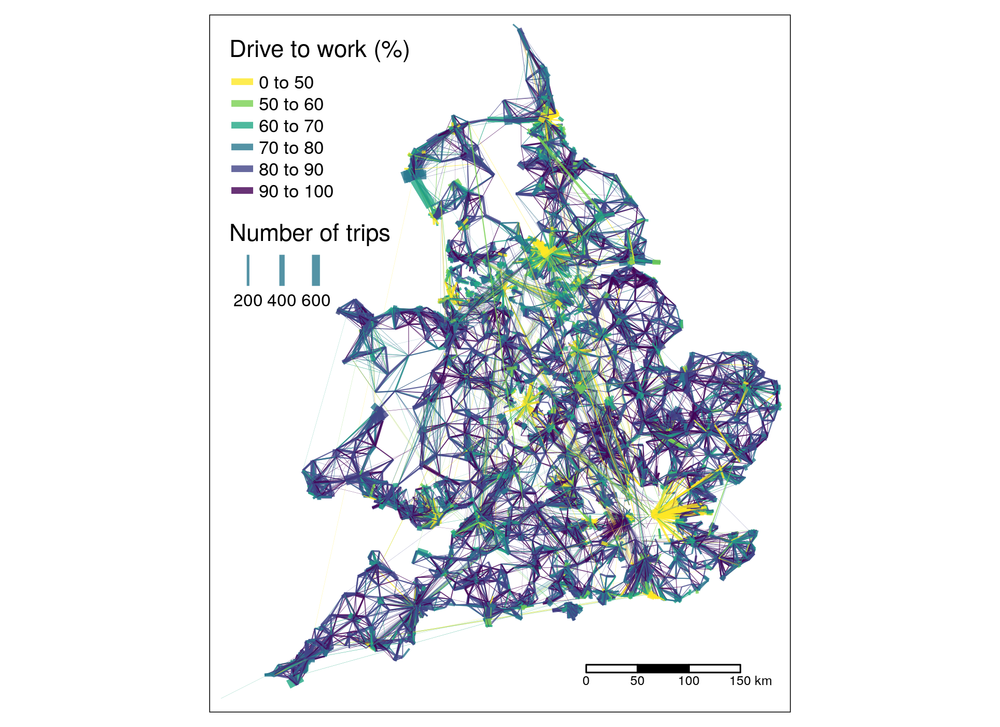

---
# # for rapid prototyping:
# output: bookdown::github_document2
# output: bookdown::html_document2
output: bookdown::word_document2
# #  for final pdf:
# output:
#   bookdown::pdf_document2:
#     template: GISRUKPaperTemplate.tex
bibliography: references.bib
title: "Assessing methods for generating route networks from origin-destionation data: jittering, routing, and visualisation"
---

<!-- README.md is generated from README.Rmd. Please edit that file -->

```{r, echo=FALSE, eval=FALSE}
# count words
wordcountaddin::text_stats_chr(readLines("README.Rmd"))
# get the data:
system("wget https://github.com/dabreegster/odjitter/archive/refs/heads/main.zip")
unzip("main.zip")
file.rename("odjitter-main/data", "data")
file.copy("README.pdf", "odnet.pdf", overwrite = TRUE)
piggyback::pb_upload("odnet.pdf")
piggyback::pb_download_url("odnet.pdf")
# https://github.com/Robinlovelace/odnet/releases/download/0/odnet.pdf
```


```{r, include=FALSE}
rbbt::bbt_update_bib("README.Rmd", path_bib = "references.bib")
knitr::opts_chunk$set(
  collapse = TRUE,
  comment = "#>",
  echo = FALSE,
  cache = TRUE,
  message = FALSE
)
library(tidyverse)
library(tmap)
library(stplanr)
```

# Introduction

Origin-destination (OD) datasets are used to represents movement through geographic space, from an origin (O) to a destination (D).
Also referred to as 'flow data'^[https://www.ons.gov.uk/census/2011census/2011censusdata/originanddestinationdata] OD datasets usually contain not only information about where they start or end, but also about the amount of movement between zones (which are often represented by a zone centroid) or other geographic entities.
Because of their ability to encode a large amount of information about millions of trips in a relatively small amount of storage space, with the maximum number of rows in an aggregate OD dataset equal to square of the number of zones squared, including intra-zonal OD pairs.
Thus, the entire transport system of city the size of Edinburgh, with a population just over 500,000 people, can be represented at the level of desire lines between the city's 111 enumeration districts ([EDs](https://www.ons.gov.uk/methodology/geography/ukgeographies/censusgeography)) with 111^2 (12,321) rows and a number of columns depending on the number of trip types.^[
In practice, not all combinations of OD pairs have trips between them, so the square of the number of zones is an upper limit.
The number of rows of data in the input OD dataset we use in this paper has 10,394 rows, 16% fewer than the maximum that could be represented by trips between every combination of zones.
The .csv file associated with this dataset representing the transport system in Edinburgh (albeit only for work and representing only single stage trips in one direction) is only 0.3 MB, a compact way of storing information on travel behaviour compared with alternatives such as large GPS datasets.
]

Because of their small size and simplicity, OD datasets have long been used to describe aggregate urban mobility patterns [@carey_method_1981].
Typically, OD datasets are represented *geographically* as straight 'desire lines' between zone centroids, with all trips shown as departing from and arriving to a single centroid per zone, for convenience, simplicity and (historically) to reduce computational requirements.
This approach, illustrated in Figure \@ref(fig:od1) below, has formed the basis of many visualisations and research projects using OD data [e.g. @rae_spatial_2009; @calabrese_estimating_2011].
Connecting zones with straight lines in this way has advantages: it can provide a quick summary of the movement patterns between zones, particularly when attributes such as total number of trips and the percentage of trips made by a particular mode are represented by variable aesthetics such as line width and colour, as illustrated in Figure \@ref(fig:od1).

```{r od1, fig.cap="Illustration of typicall representation of OD dataset, illustrating travel to work patterns in England. Source: author's [analysis](https://github.com/creds2/od-data) of open access data from the 2011 Census.", out.width="80%"}
# system("wget https://github.com/creds2/od-data/blob/master/overview_map1.png") # failed
# file.copy("~/orgs/creds2/od-data/overview_map1.png", ".")


```

However, the approach has limitations, including:

1. people do not travel in straight lines!
2. centroid-based desire lines obscure two-way flows [@tennekes_design_2021]
3. unrealistic concentration of travel around certain points

One way to add richness and realism to OD data is to convert the geographic desire lines into routes on the network and then aggregate the associated data to the route segment level to create route network outputs [@morgan_travel_2020].
Route network generation from centroid-based desire lines addresses limitations 1 and 2 outlined above, but not 3.
Recently proposed 'jittering' methods seek to overcome all three limitations inherent to the centroid-based converstion of OD datasets to geographic desire lines [@lovelace_jittering_2022].

<!-- In this paper we explore the potential for jittering . -->
<!-- We are concerned with more than the visualisation of the data. -->
The aim of this paper is to quantify, for the first time to the best of our knowledge, the impact of jittering --- and different input parameters used in the jittering process --- on the quality of route networks derived from OD data.
<!-- , by  estimated flow  network from the route network results and real world datasets, and valuable open access datasets for subsequent geographic analysis steps. -->

<!-- Todo: add figure showing this? -->

# Data and methods

The geographic input datasets on which the analysis presented in this paper build are cleaned versions of open datasets representing the transport system in Edinburgh (see Figure \@ref(fig:overview)):

- Open zones data, stored in [`iz_zones11_ed`](https://github.com/ITSLeeds/od/releases/download/v0.3.1/iz_zones11_ed.geojson)
- Open road network data from OSM, stored as [`road_network_ed.geojson`](https://github.com/Robinlovelace/odnet/releases/download/0/cycle_counts_edinburgh_summary_2020-03-02-2022-01-05.geojson)

A non-geographic OD dataset representing trips between the zones was also generated from the UK National travel survey 2011 data and saved as a [.csv file](https://github.com/ITSLeeds/od/releases/download/v0.3.1/od_iz_ed.csv), the first three elements of which are presented in the table below.

```{r}
# download data
if(!file.exists("cycle_counts_edinburgh_summary_2020-03-02-2022-01-05.geojson")) {
system("wget https://github.com/Robinlovelace/odnet/releases/download/0/cycle_counts_edinburgh_summary_2020-03-02-2022-01-05.geojson")
system("wget https://github.com/ITSLeeds/od/releases/download/v0.3.1/od_iz_ed.csv")
system("wget https://github.com/ITSLeeds/od/releases/download/v0.3.1/iz_zones11_ed.geojson")
system("wget https://github.com/Robinlovelace/odnet/releases/download/0/road_network_ed.geojson")
}
```


```{r}
counters = sf::read_sf("https://github.com/Robinlovelace/odnet/releases/download/0/cycle_counts_edinburgh_summary_2020-03-02-2022-01-05.geojson")
od = readr::read_csv("https://github.com/ITSLeeds/od/releases/download/v0.3.1/od_iz_ed.csv")
zones = sf::read_sf("https://github.com/ITSLeeds/od/releases/download/v0.3.1/iz_zones11_ed.geojson")
centroids = sf::read_sf("https://github.com/ITSLeeds/od/releases/download/v0.3.1/iz_centroids11_ed.geojson")
network = sf::read_sf("network.geojson")
desire_lines = od::od_to_sf(od, zones)
# sf::write_sf(road_network, "road_network_ed.geojson")
# piggyback::pb_upload("road_network_ed.geojson")
```

```{r}
od %>% 
  slice(1:3) %>% 
  select(-from_home, -other) %>% 
  knitr::kable(caption = "Sample of three rows from the OD dataset used in this paper (from home and other modes not shown).", booktabs = TRUE)
```


```{r overview, fig.cap="Overview of the study area and the input geographic datasets. Dot size is proportional to mean cycle count at counter locations."}
tm_shape(zones) +
  tm_borders(alpha = 0.5) +
  tm_shape(network) +
  tm_lines(col = "red", lwd = 0.2) +
  tm_shape(counters, size = 2) +
  tm_dots(size = "mean_count", size.lim = c(100, 1000))
```

To test the performance of different parameters and settings for the OD-to-route-network conversion process, we focussed only on cycling trips as these were measured in the counter dataset mentioned.
Furthermore, we focussed on only the desire lines representing 4 or more cycle trips, to reduce the computational requirements of the study in the time available: this reduced the number of desire lines from over 10,000 to 685.

<!-- To run algorithm you need a minimum of three inputs, examples of which are provided in the `data/` folder of this repo: -->

<!-- 1. A .csv file containing OD data with two columns containing zone IDs (specified with  `--origin-key=geo_code1 --destination-key=geo_code2` by default) and other columns representing trip counts: -->
<!-- ```{r, echo=FALSE, message=FALSE} -->
<!-- od = readr::read_csv("data/od.csv") -->
<!-- knitr::kable(od[1:3, ]) -->
<!-- ``` -->
<!-- 2. A [.geojson file](https://github.com/dabreegster/odjitter/blob/main/data/zones.geojson) representing zones that contains values matching the zone IDs in the OD data (the field containing zone IDs is specified with `--zone-name-key=InterZone` by default): -->
<!-- ```{r, echo=FALSE} -->
<!-- # zones = sf::read_sf("data/zones.geojson") -->
<!-- # zones[1:3, ] -->
<!-- ``` -->
<!-- ```{bash} -->
<!-- head -6 data/zones.geojson -->
<!-- ``` -->
<!-- 3. A [.geojson file](https://github.com/dabreegster/odjitter/blob/main/data/road_network.geojson) representing a transport network from which origin and destination points are sampled -->
<!-- ```{bash} -->
<!-- head -6 data/road_network.geojson -->
<!-- ``` -->

The jittering process was undertaken with the Rust crate `odjitter`, which can be replicated using the following reproducible code run from a system terminal such as Bash on Linux, PowerShell on Windows or the Mac Terminal ([Cargo](https://doc.rust-lang.org/cargo/getting-started/installation.html) must be installed for this to work).

First install the `odjitter` Rust crate and command line tool:

```bash
cargo install --git https://github.com/dabreegster/odjitter
```

Generate jittered OD pairs with a `max-per-od` value of 50 as follows:

```bash
odjitter --od-csv-path od_iz_ed.csv \
  --zones-path iz_zones11_ed.geojson \
  --subpoints-path road_network_ed.geojson \
  --max-per-od 50 --output-path output_max50.geojson
```

Try running it with a different `max-per-od` value (10 in the command below):

```bash
odjitter --od-csv-path od_iz_ed.csv \
  --zones-path iz_zones11_ed.geojson \
  --subpoints-path road_network_ed.geojson \
  --max-per-od 10 --output-path output_max50.geojson
```

```{r}
desire_lines = od::od_to_sf(od, zones)
# sum(desire_lines$bicycle > 0) # 3367
desire_lines_top = desire_lines %>% 
  top_n(n = 500, wt = bicycle)
# sf::write_sf(desire_lines_top, "desire_lines_top.geojson")
# piggyback::pb_upload("desire_lines_top.geojson")
# write_csv(desire_lines_top %>% sf::st_drop_geometry(), "od_top.csv")
# piggyback::pb_upload("od_top.csv")
```

<!-- Generate results for top 500, run once: -->

```{bash, eval=FALSE}
odjitter --od-csv-path od_top.csv \
  --zones-path iz_zones11_ed.geojson \
  --subpoints-path road_network_ed.geojson \
  --max-per-od 1000 --output-path output_max10k.geojson
odjitter --od-csv-path od_top.csv \
  --zones-path iz_zones11_ed.geojson \
  --subpoints-path road_network_ed.geojson \
  --max-per-od 50 --output-path output_max50.geojson
odjitter --od-csv-path od_top.csv \
  --zones-path iz_zones11_ed.geojson \
  --subpoints-path road_network_ed.geojson \
  --max-per-od 10 --output-path output_max10.geojson
```


# Findings

Figure \@ref(fig:output1) shows the output of the jittering process described in [@lovelace_jittering_2022] and implemented with the `jitter` commands above visually.
The facets a to d show the impacts of jittering  with different values set for the maximum number of trips allowable per 'jittered desire line', and implemented with the argument `max-per-od` in the previous section.
It is clear that even jittering without disaggregation has a substantial impact: Figure \@ref(fig:output1) b) represents the same number of desire lines but with widely distributed start and end points.

The maps in Figure \@ref(fig:output1) c) and d) show the impact of reducing the threshold for the number of trips allowed: although every facet represents the same number of travel, the trips are represented with around double the number of desire lines in c) and triple the number of desire lines in d) compared with the original OD dataset.
To assess whether this process of disaggregation/jittering adds value to the OD data, we generated results at the route network level and evaluated them with reference to the cycle counter dataset outlined in the previous section.

```{r}
# list.files(pattern = "output")
network_filenames = c("desire_lines_top.geojson", "output_max10k.geojson", "output_max50.geojson", "output_max10.geojson")
names(network_filenames) = c("Centroid-based", "Jittered (no disaggregation)", "Jittered (50 trips max)", "Jittered (10 trips max)")
```

```{r output1, message=FALSE, fig.cap="Results at the desire line level. The top left image shows unjittered results with origins and destinations going to zone centroids (as in many if not most visualisations of desire lines between zones). Top right: jittered results without disaggregation. Bottom left: result with a maximum number of trips per jittered OD pair of 50. Bottom right: result result with a maximum number of trips per jittered OD pair of 10.", fig.height=6, fig.width=6}
network = sf::read_sf("network.geojson")
# Replicating in ggplot2 -- benefits in that can more easily
# play with visual parameters add titles etc. than baseR.
# Also can extend in various ways (using different line primitives etc.)

desire_lines_joined = purrr::map_dfr(1:length(network_filenames), function(i) {
  f = network_filenames[i]
  message(f)
  desire_lines = sf::read_sf(f)
  desire_lines$type = paste0(letters[i], ") ", names(network_filenames)[i], ". N. lines: ", nrow(desire_lines))
  desire_lines
})
desire_lines_joined = desire_lines_joined %>% 
  mutate(type_factor = factor(type, levels = names(network_filenames)))

tm_output1 = tm_shape(zones, bbox = tmaptools::bb(zones, ext = 0.8)) +
  tm_borders(alpha = 0.8, lwd = 2, col = "grey") +
  tm_shape(network) +
  tm_lines(col = "red", lwd = 0.2) +
  tm_shape(desire_lines_joined) +
  tm_lines(lwd = "bicycle", title.lwd = "Number of trips", lwd.legend = c(10, 50), scale = 2) +
  tm_facets(by = "type", free.coords = FALSE) +
  tm_layout(legend.outside = FALSE)
tm_output1
```

<!-- Todo: update the above figure with more variations and show resulting route networks below -->

<!-- Todo: present results comparing flow from counter data with route network results -->

```{r, eval=FALSE}
# routing
library(cyclestreets)
i = network_filenames[1]
for(i in network_filenames) {
  message("Getting routes for ", i)
  desire_lines_i = sf::read_sf(i)
  message("There are ", nrow(desire_lines_i), " desire lines with ", sum(desire_lines_i$bicycle), " trips")
  system.time({
  routes_fast_top = route(l = desire_lines_i, route_fun = journey)
  })
  r_routes = paste0("routes_", i)
  file.remove(r_routes)
  sf::write_sf(routes_fast_top, r_routes)
  piggyback::pb_upload(r_routes)
  piggyback::pb_download_url(r_routes)
}
```

The route network level results associated with the same OD pairs are shown in Figure \@ref(fig:rnets).
The results suggest that jittering improve network accuracy compared with a ground truth dataset, even without first disaggregating the input OD datasets.
A notable finding, albeit from a small 'ground truth' dataset, is that jittering can improve route network resutls *at no no extra computational cost* in terms of routing, often the most time-consuming aspect of transport modelling workflows: networks shown in Figure \@ref(fig:rnets) a) and b) both result from calculating routes associated with 685 desire lines, but b) shows a more diffuse network.
Furthermore, the results suggest that disaggregation is worth extra computational costs associated with routing for more desire lines, with R-Squared results quantifying the relationship between observed daily counts and the level of flow in the nearest segment on route improving with further disaggregation.

```{r rnets, fig.cap="Route network results.", fig.asp=0.6}
# u1 = "https://github.com/Robinlovelace/odnet/releases/download/0/routes_fast_top.geojson"
# f1 = basename(u1)
# if(!file.exists(f1)) download.file(u1, f1)
routes_names = paste0("routes_", network_filenames)
i = routes_names[1]
d = data.frame(route_file_names = routes_names)
d$network_type = names(network_filenames)
d$r_sqaured = NA
j = 1
rnet_list = lapply(1:length(routes_names), function(i) {
  message(i)
  routes = sf::read_sf(routes_names[i])
  rnet_fast = overline(routes, "bicycle")
  rnet_fast$type = names(network_filenames)[i]
  counters_joined = sf::st_join(counters, rnet_fast, join = sf::st_nearest_feature)
  rnet_fast$cor = cor(counters_joined$mean_count, counters_joined$bicycle)^2
  rnet_fast$facet_character = paste0(letters[i], ")")
  rnet_fast
})
rnet_df = dplyr::bind_rows(rnet_list)
rnet_df = rnet_df %>% 
  mutate(type_cor = paste0(facet_character, " ", type, ". R-squared: ", round(cor, 3)))
# map_list = lapply(1:length(routes_names), function(i) {
#   counters_joined = sf::st_join(counters, rnet_fast, join = sf::st_nearest_feature)
#   cor = cor(counters_joined$mean_count, counters_joined$bicycle)^2
#   message("R-squared for ", i, " is ", cor)
#   d$r_sqaured[j] = cor
#   tm_shape(rnet_fast) +
#     tm_lines(lwd = "bicycle", scale = 4, lwd.legend = c(100, 500)) +
#     tm_credits(text = paste0("R-Squared counter-network fit: ", round(cor, 2)), size = 5) +
#     tm_layout(title = d$network_type[j])
# })
# tmap_arrange(rnet_list[[1]], rnet_list[[2]], rnet_list[[3]], rnet_list[[4]])
# central_edinburgh = stplanr::geo_code("edinburgh")
# [1] -3.188375 55.953346
tm_shape(rnet_df, bbox = tmaptools::bb(zones, ext = 0.4, cx = -3.188375, cy = 55.953346)) +
  tm_lines(lwd = "bicycle", scale = 4, lwd.legend = c(100, 500)) +
  tm_facets("type_cor") +
  tm_layout(legend.outside = FALSE)
```

\pagebreak

# Discussion

The results presented above support the hypothesis that 'jittering' techniques outlined in [@lovelace_jittering_2022] can add value to OD data.
The process of randomising start and end points to vertices on a transport network, combined with variable levels of disaggregation --- the process of splitting single OD pairs into multiple desire lines based on a threshold value for the maximum number of trips that can be represented in a single jittered desire line --- clearly leads to more diffuse networks.
The progressive improvements in network-counter fit are encouraging, although we note that the best fit implies that only 6% of the variability on daily average count datasets can be explained by route network level results.
Thus, the results should be seen more as a proof-of-concept highlighting the *potential* value of jittering when converting OD datasets to route networks, rather than definitive findings.

The approach is not without limitations. 
Despite the variability of places where the automatic bicycle counters are located, they are only 40 in number, which were used to test the method.
It should also be noted that the OD data is from 2011, while the counter datasets are from 10 years later and represents cycle trips for all purposes, not just travel to work.
These limitations help explain the poor counter-network results and, more importantly, suggest ways to gain further understanding of ways to improve network generation processes.
Promising avenues of future research could include:

- Exploring the impact of other parameters in the OD to route network generation process, including:
    - The routing profile used, which can 'prefer' different route types, resulting in 'quiet' to 'fast' networks [@desjardins_correlates_2021]
    - Further disaggregation levels, including full disaggregation (one desire line and route per trip) and generation of 'centroid connectors' [@jafari_investigation_2015; @friedrich_methods_2009]
    - Testing different jittering strategies used to sample origin and destination points within zones, such as using open building datasets to generate start and end points [@lovelace_jittering_2022] 
- Repeating the tests outlined in this paper but with larger and richer input datasets

We believe that pursuing such lines of inquiry should be a priority for sustainable transport planning.
New insights could lead to improved evidence on which to develop investment strategies, such as route networks presenting estimates of baseline levels, and potential uptake, of sustainable transport modes, improving on route network results derived from 'centroid-based' desire lines [e.g. @goodman_scenarios_2019; @lovelace_propensity_2017; @biba_new_2010].^[
See the Technical Note produced by consultancy PJA for Staffordshire's Local Cycling and Walking Infrastructure Plan for a good example o the use of centroid-based desire lines for routing in practice: https://www.staffordshire.gov.uk/Transport/transportplanning/documents/Appendix-B-PJA-GIS-Analysis-Technical-Note.pdf 
]

Acknowledgements
================

This work was supported by ESRC and ADR's [10DS Fellowship](https://www.adruk.org/news-publications/news-blogs/esrc-and-adr-uk-funded-research-fellows-to-work-with-no10-downing-street-487/) funding, and the Alan Turing Institute.

This research was supported by the Portuguese Foundation for Science and Technology (FCT) with the the PARSUK Portugal-UK Bilateral Research Fund.


Biography
=========

<!-- All contributing authors should include a biography of no more than 50 -->
<!-- words each outlining their career stage and research interests. -->

Robin is an Associate Professor of Transport Data Science working at the University of Leeds' Institute for Transport Studies (ITS) and Leeds Institute for Data Analytics (LIDA).
Robin is undertaking a fellowship to support evidence-based decision making in central government in collaboration with the No. 10 Data Science Team and is an Alan Turing Fellow, specialising in transport modelling, geocomputation and data driven tools for evidence-based decision making to support policy objectives including uptake of active travel to maximise health, wellbeing and equity outcomes, and rapid decarbonisation of local, city, regional and national transport systems.

Rosa is an urban cycling and active mobility researcher at Instituto Superior Técnico - University of Lisbon, and a PhD in Transportation Systems in the MIT Portugal program. Rosa is interested in GIS for transportation, and has been working on cycling uptake in low cycling maturity cities, and socioeconomic impacts of shared mobility.

Dustin is a software engineer at the Alan Turing Institute, where he's creating
an ecosystem of interoperable digital twins to study urban transportation and
pandemics. He's the creator of the [A/B Street](https://abstreet.org)
transportation planning platform, and a proponent of open source code and the
Rust programming language.

Roger is an Associate Professor of Visual Data Science in School of Geography, University of Leeds. His research develops, applies and evaluates visualization techniques in the analysis of large geospatial datasets. A current focus is on the use of visual techniques for supporting inference in geographical analysis.


# References
