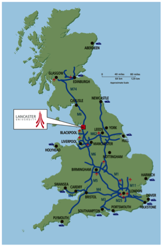

<!-- README.md is generated from README.Rmd. Please edit that file -->

# 1 Introduction

# 2 Methods

# 3 Data

# 4 Implementations

# 5 Findings

# 6 Discussion

<!-- Original LaTeX: -->
<!-- \begin{figure}[htbp] \begin{center}  -->
<!-- \resizebox{0.3\textwidth}{!}{  -->
<!--    \includegraphics{lancaster.png} -->
<!-- } \caption{Location of Lancaster University} \label{first_figure} \end{center} \end{figure} % -->

# 7 References and Citations

A list of references cited should be provided at the end of the paper
using the Harvard format as shown below. Citations of these within the
text should be given as follows: papers such as (Openshaw 1991) or a
paper by Rey (2009).

Books can also be cited (Graser 2014).

# 8 File format

Papers should be submitted in unrestricted **pdf** format. Authors are
requested to keep to the word limit of 1500 words.

# 9 Acknowledgements

Acknowledgement should be made of any funding bodies who have supported
the work reported in the paper, of those who have given permission for
their work to be reproduced or of individuals whose particular
assistance is due recognition. Acknowledge data providers here where
appropriate.

# 10 Biography

All contributing authors should include a biography of no more than 50
words each outlining their career stage and research interests.

# 11 References

Graser, Anita. 2014. *Learning Qgis*. Packt Publishing Ltd.

Openshaw, Stan. 1991. “A View on the GIS Crisis in Geography, or, Using
GIS to Put Humpty-Dumpty Back Together Again.” *Environment and Planning
A* 23 (5): 621–28.

Rey, Sergio J. 2009. “Show Me the Code: Spatial Analysis and Open
Source.” *Journal of Geographical Systems* 11 (2): 191–207.

