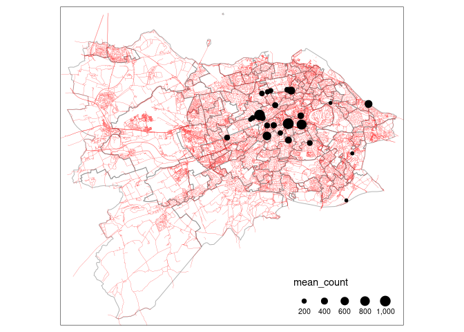

Disaggregating origin-destination data: methods, implementations, and
optimal parameters for generating accurate route networks for
sustainable transport planning
================

<!-- README.md is generated from README.Rmd. Please edit that file -->

# 1 Introduction

Origin-destination (OD) datasets are used to represents movement through
geographic space, from an origin (O) to a destination (D). Also referred
to as ‘flow data’[^1] OD datasets usually contain not only information
about where they start or end, but also about the amount of movement
between zones (which are often represented by a zone centroid) or other
geographic entities. Because of their ability to encode a large amount
of information about millions of trips in a relatively small amount of
storage space, with the maximum number of rows in an aggregate OD
dataset equal to square of the number of zones squared, including
intra-zonal OD pairs. Thus, the entire transport system of London can be
represented, albeit simplistically, as an OD dataset representing
movement between the city’s 33 boroughs with only 33^2 (1089) rows and a
number of columns depending on the number of trip types.

Because of these easy-to-use characteristics, OD datasets have long been
used to describe aggregate urban mobility patterns (Carey, Hendrickson,
and Siddharthan 1981). Typically, OD datasets are represented
*geographically* as straight ‘desire lines’ between zone centroids, with
all trips shown as departing from and arriving to a single centroid per
zone, for convenience, simplicity and (historically) to reduce
computational requirements. This approach, illustrated in Figure
<a href="#fig:od1">1.1</a> below, has formed the basis of many
visualisations and research projects using OD data (e.g. Rae 2009;
Calabrese et al. 2011).

 of open access data from
the 2011 Census.](overview_map1.png)

Connecting zones with straight lines in this way has advantages: it can
provide a quick summary of the movement patterns between zones,
particularly when attributes such as total number of trips and the
percentage of trips made by a particular mode are represented by
variable aesthetics such as line width and colour, as illustrated in
Figure <a href="#fig:od1">1.1</a>.

However, the approach has limitations, including:

1.  people do not travel in straight lines!
2.  centroid-based desire lines obscure two-way flows (Tennekes and Chen
    2021)
3.  incorrect concentration of travel around certain points

One way to add richness and realism to OD data is to convert the
geographic desire lines into routes on the network and then aggregate
the associated data to the route segment level to create route network
outputs (Morgan and Lovelace 2020). Route network generation from
centroid-based desire lines addresses limitations 1 and 2 outlined
above, but not 3. In this paper we explore the potential for different
‘jittering’ and disaggregation approaches to address limitations 1 to 3.
Unlike some previous methodological papers on OD data, we are not only
concerned with the visualisation of the data. The aim is to not only
create informative visualisations but also to generate accurate results,
measured as a correlation between estimated flow on the network from the
route network results and real world datasets, and valuable open access
datasets for subsequent geographic analysis steps.

<!-- Todo: add figure showing this? -->

# 2 Data and methods

The geographic input datasets on which the analysis presented in this
paper build are cleaned versions of open datasets representing the
transport system in Edinburgh:

-   Open access cycle counter data, stored in
    [`cycle_counts_59_edinburgh_summary_2020-03-02-2022-01-05.geojson`](https://github.com/Robinlovelace/odnet/releases/download/0/cycle_counts_59_edinburgh_summary_2020-03-02-2022-01-05.geojson)
-   Open zones data, stored in
    [`iz_zones11_ed`](https://github.com/ITSLeeds/od/releases/download/v0.3.1/iz_zones11_ed.geojson)
-   Open road network data from OSM, stored as
    [`road_network_ed.geojson`](https://github.com/Robinlovelace/odnet/releases/download/0/cycle_counts_59_edinburgh_summary_2020-03-02-2022-01-05.geojson)

A non-geographic OD dataset representing trips between the zones was
also generated and saved as a [.csv
file](https://github.com/ITSLeeds/od/releases/download/v0.3.1/od_iz_ed.csv),
the first three elements of which are presented in the table below.

| geo_code1 | geo_code2 | all | from_home | train | bus | car_driver | car_passenger | bicycle | foot | other |
|:----------|:----------|----:|----------:|------:|----:|-----------:|--------------:|--------:|-----:|------:|
| S02001576 | S02001576 | 151 |         0 |     0 |   6 |         61 |             7 |       5 |   70 |     2 |
| S02001576 | S02001577 | 132 |         0 |     0 |  11 |         84 |            10 |      11 |   15 |     1 |
| S02001576 | S02001578 |  40 |         0 |     0 |   5 |         32 |             2 |       0 |    1 |     0 |

Table 2.1: Sample of three rows from the OD dataset used in this paper.

<!-- -->

<!-- To run algorithm you need a minimum of three inputs, examples of which are provided in the `data/` folder of this repo: -->
<!-- 1. A .csv file containing OD data with two columns containing zone IDs (specified with  `--origin-key=geo_code1 --destination-key=geo_code2` by default) and other columns representing trip counts: -->
<!-- ```{r, echo=FALSE, message=FALSE} -->
<!-- od = readr::read_csv("data/od.csv") -->
<!-- knitr::kable(od[1:3, ]) -->
<!-- ``` -->
<!-- 2. A [.geojson file](https://github.com/dabreegster/odjitter/blob/main/data/zones.geojson) representing zones that contains values matching the zone IDs in the OD data (the field containing zone IDs is specified with `--zone-name-key=InterZone` by default): -->
<!-- ```{r, echo=FALSE} -->
<!-- # zones = sf::read_sf("data/zones.geojson") -->
<!-- # zones[1:3, ] -->
<!-- ``` -->
<!-- ```{bash} -->
<!-- head -6 data/zones.geojson -->
<!-- ``` -->
<!-- 3. A [.geojson file](https://github.com/dabreegster/odjitter/blob/main/data/road_network.geojson) representing a transport network from which origin and destination points are sampled -->
<!-- ```{bash} -->
<!-- head -6 data/road_network.geojson -->
<!-- ``` -->
<!-- The `jitter` function requires you to set the maximum number of trips for all trips in the jittered result. -->
<!-- A value of 1 will create a line for every trip in the dataset, a value above the maximum number of trips in the 'all' column in the OD ata will result in a jittered dataset that has the same number of desire lines (the geographic representation of OD pairs) as in the input (50 in this case). -->
<!-- With reference to the test data in this repo, you can run the `jitter` command line tool as follows: -->
<!-- ```{bash} -->
<!-- odjitter --od-csv-path data/od.csv \ -->
<!--   --zones-path data/zones.geojson \ -->
<!--   --subpoints-path data/road_network.geojson \ -->
<!--   --max-per-od 50 --output-path output_max50.geojson -->
<!-- ``` -->
<!-- Try running it with a different `max-per-od` value (10 in the command below): -->
<!-- ```{bash} -->
<!-- odjitter --od-csv-path data/od.csv \ -->
<!--   --zones-path data/zones.geojson \ -->
<!--   --subpoints-path data/road_network.geojson \ -->
<!--   --max-per-od 10 --output-path output_max10.geojson -->
<!-- ``` -->

# 3 Outputs

The figure below shows the output of the `jitter` commands above
visually, with the left image showing unjittered results with origins
and destinations going to zone centroids (as in many if not most
visualisations of desire lines between zones), the central image showing
the result after setting `max-per-od` argument to 50, and the right hand
figure showing the result after setting `max-per-od` to 10.


# 4 Findings

# 5 Discussion

# 6 Acknowledgements

Acknowledgement should be made of any funding bodies who have supported
the work reported in the paper, of those who have given permission for
their work to be reproduced or of individuals whose particular
assistance is due recognition. Acknowledge data providers here where
appropriate.

# 7 Biography

All contributing authors should include a biography of no more than 50
words each outlining their career stage and research interests.

Dustin is a software engineer at the Alan Turing Institute, where he's creating
an ecosystem of interoperable digital twins to study urban transportation and
pandemics. He's the creator of the [A/B Street](https://abstreet.org)
transportation planning platform, and a proponent of open source code and the
Rust programming language.

# 8 References

<div id="refs" class="references csl-bib-body hanging-indent">

<div id="ref-calabrese_estimating_2011" class="csl-entry">

Calabrese, Francesco, Giusy Di Lorenzo, Liang Liu, and Carlo Ratti.
2011. “Estimating Origin-Destination Flows Using Mobile Phone Location
Data.” *IEEE Pervasive Computing* 10 (4): 36–44.
<https://doi.org/10.1109/MPRV.2011.41>.

</div>

<div id="ref-carey_method_1981" class="csl-entry">

Carey, Malachy, Chris Hendrickson, and Krishnaswami Siddharthan. 1981.
“A Method for Direct Estimation of Origin/Destination Trip Matrices.”
*Transportation Science* 15 (1): 32–49.
<https://doi.org/10.1287/trsc.15.1.32>.

</div>

<div id="ref-morgan_travel_2020" class="csl-entry">

Morgan, Malcolm, and Robin Lovelace. 2020. “Travel Flow Aggregation:
Nationally Scalable Methods for Interactive and Online Visualisation of
Transport Behaviour at the Road Network Level.” *Environment & Planning
B: Planning & Design*, July. <https://doi.org/10.1177/2399808320942779>.

</div>

<div id="ref-rae_spatial_2009" class="csl-entry">

Rae, Alasdair. 2009. “From Spatial Interaction Data to Spatial
Interaction Information? Geovisualisation and Spatial Structures of
Migration from the 2001 UK Census.” *Computers, Environment and Urban
Systems* 33 (3): 161–78.
<https://doi.org/10.1016/j.compenvurbsys.2009.01.007>.

</div>

<div id="ref-tennekes_design_2021" class="csl-entry">

Tennekes, Martijn, and Min Chen. 2021. “Design Space of
Origin-Destination Data Visualization.” *Computer Graphics Forum* 40
(3): 323–34. <https://doi.org/10.1111/cgf.14310>.

</div>

</div>

[^1]: <https://www.ons.gov.uk/census/2011census/2011censusdata/originanddestinationdata>
